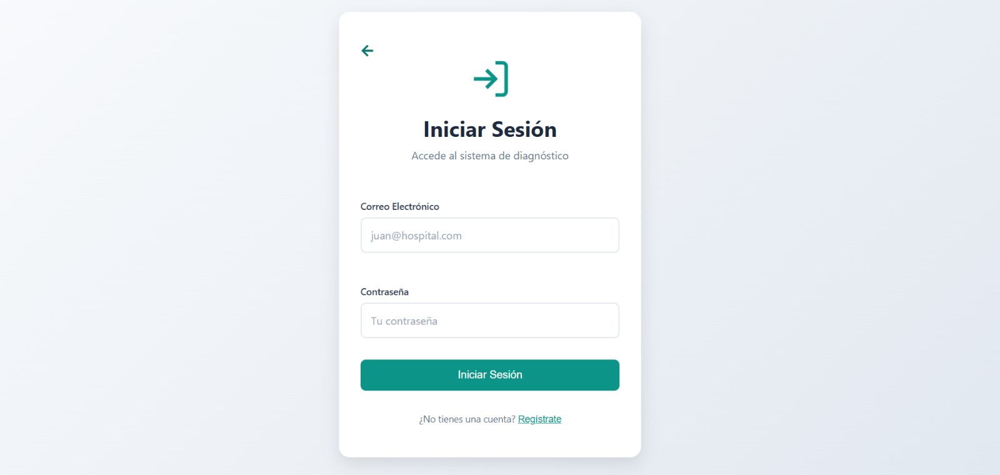
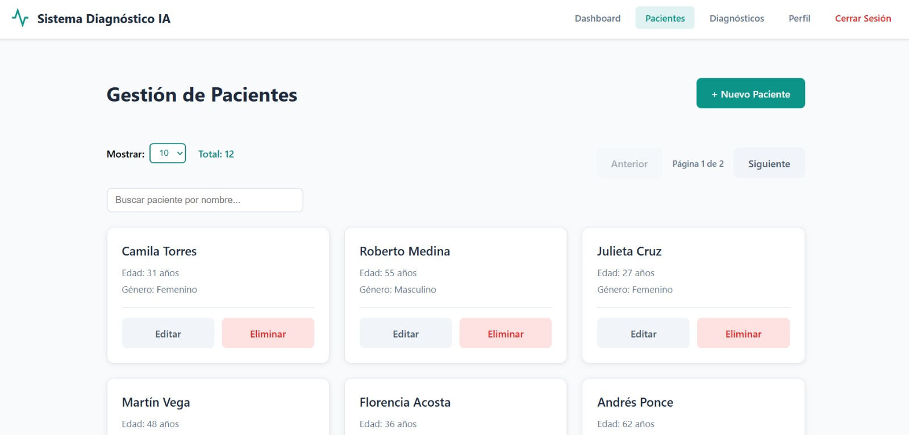
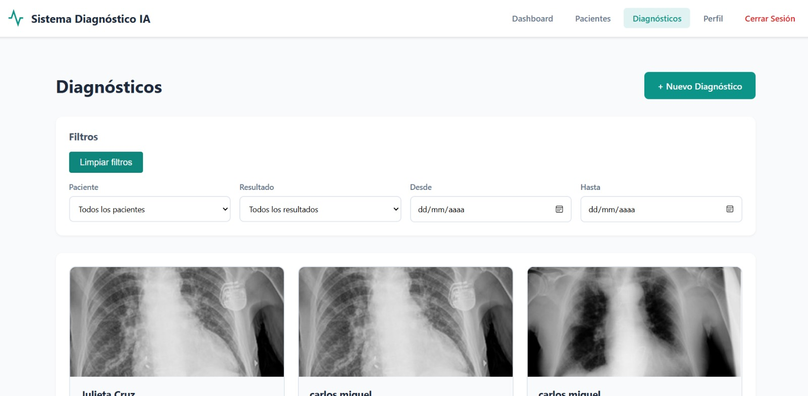
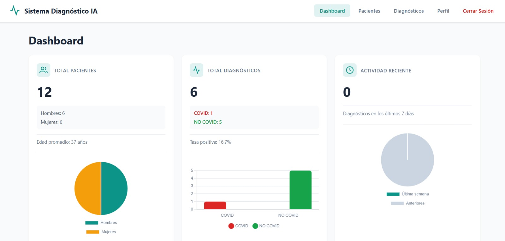

# APLICACIÓN DE DETECCIÓN DE COVID

Sistema web para el apoyo al diagnóstico médico mediante el análisis de radiografías de tórax (X-ray), orientado a su uso en entornos hospitalarios.
La aplicación permite a los doctores diagnosticar imágenes de rayos X de forma rápida utilizando inteligencia artificial.

El sistema integra el modelo **COV_ADSX**, un modelo de código abierto para la detección de COVID-19, reutilizado e integrado en una arquitectura moderna con **backend en Flask** y **frontend en React**.

---

## Modelo de Inteligencia Artificial

* Modelo: **COV_ADSX**
* Autor: sharifhasani
* Tipo: Deep Learning / Machine Learning
* Entrada: Imagen X-ray
* Salida: Resultado del diagnóstico y nivel de confianza
* Estado: Modelo previamente entrenado (no se realizó reentrenamiento)


---

## Fuente del Modelo de Inteligencia Artificial

El modelo de detección de COVID-19 integrado en este proyecto fue obtenido de un **artículo científico publicado** y de su implementación oficial de código abierto.
El trabajo original propone un sistema automatizado para la detección de COVID-19 a partir de imágenes de rayos X de tórax, combinando **Deep Learning** y **XGBoost**.

### Artículo Científico Original

**Hasani, S., & Nasiri, H. (2022).**
**COV-ADSX: An Automated Detection System using X-ray Images, Deep Learning, and XGBoost for COVID-19.**
*Software Impacts, Volume 11, 100210.*
Elsevier B.V.

DOI:
[https://doi.org/10.1016/j.simpa.2021.100210](https://doi.org/10.1016/j.simpa.2021.100210)

---

### Descripción del Modelo (según el artículo)

* Entrada: Imagen de rayos X de tórax (CXR)
* Extracción de características: **DenseNet169 (Deep Neural Network preentrenada)**
* Clasificación: **XGBoost**
* Visualización: **Grad-CAM (mapa de calor)**
* Precisión reportada: **98.23%** (dataset ChestX-ray)
* Tiempo de respuesta: menor a 10 segundos
* Entrenamiento del DNN: no requerido (modelo preentrenado)

---

### Implementación Original

* Repositorio oficial del software:
  [https://github.com/sharifhasani/COV_ADSX](https://github.com/sharifhasani/COV_ADSX)
* Licencia: **GNU General Public License v3.0**
* Framework original: Django
* Lenguaje: Python

---

### Uso del Modelo en este Proyecto

En este proyecto:

* No se entrenó ni modificó el modelo original.
* El modelo **COV-ADSX fue reutilizado e integrado** dentro de un nuevo sistema.
* Se rediseñó la arquitectura usando:

  * Backend: Flask (API REST)
  * Frontend: React
* El objetivo fue adaptar el modelo a un **entorno hospitalario**, permitiendo:

  * Autenticación de doctores
  * Gestión de pacientes
  * Almacenamiento de diagnósticos
  * Visualización de resultados y mapas de calor

El uso del modelo respeta la licencia original y tiene fines académicos y experimentales.


---

## Tecnologías Utilizadas

### Lenguaje y Entorno

* Python 3.8.8
* Node.js

### Backend

* Flask
* Flask-JWT-Extended
* Flask-SQLAlchemy
* Flask-CORS
* SQLAlchemy
* JWT
* MySQL / SQLite

### Frontend

* React
* JavaScript
* HTML5
* CSS3
* Axios

### Inteligencia Artificial

* TensorFlow 2.13.0
* Keras
* XGBoost
* OpenCV
* NumPy
* Pandas
* Scikit-learn

---

## Dependencias del Proyecto

Las dependencias del proyecto se pueden instalar automáticamente usando:

```bash
pip install -r requirements.txt
```

El proyecto fue desarrollado y probado con las siguientes versiones principales:

```text
Flask 3.0.3
TensorFlow 2.13.0
Keras 2.13.1
XGBoost 1.3.3
SQLAlchemy 1.4.49
Flask-JWT-Extended 4.6.0
OpenCV-Python 4.12.0
NumPy 1.24.3
Pandas 2.0.3
```

(La lista completa de paquetes puede verse ejecutando `pip list`.)

---

## Arquitectura del Sistema

### Componentes

* **Frontend (React)**
  Interfaz gráfica para doctores.

* **Backend (Flask API REST)**
  Gestión de autenticación, pacientes, diagnósticos y comunicación con el modelo de IA.

* **Modelo IA (COV_ADSX)**
  Procesamiento de imágenes X-ray y generación de resultados.

### Flujo de Trabajo

1. El doctor inicia sesión.
2. Registra o selecciona un paciente.
3. Carga una imagen X-ray.
4. El backend ejecuta el modelo COV_ADSX.
5. El resultado se guarda en la base de datos y se muestra en el frontend.

---

## Instalación y Ejecución

### Requisitos Previos

* Python 3.8.8
* pip
* Node.js
* MySQL o SQLite

---

### Instalación del Backend

```bash
pip install -r requirements.txt
```

---

### Configuración de la Base de Datos

```sql
CREATE DATABASE hospital_ia;
USE hospital_ia;
```

#### Inserción de Datos Iniciales

```sql
INSERT INTO doctors (email, password, full_name, specialty)
VALUES
('doctor1@hospital.com', 'hashed_password_123', 'Dr. Juan Pérez', 'Neumología'),
('doctor2@hospital.com', 'hashed_password_456', 'Dra. María López', 'Radiología');

INSERT INTO patients (doctor_id, full_name, dni, age, gender)
VALUES
(1, 'Carlos Gómez', '12345678', 45, 'M'),
(1, 'Ana Martínez', '87654321', 38, 'F'),
(2, 'Luis Fernández', '11223344', 60, 'M');
```

---

### Inicializar la Base de Datos (Flask-Migrate)

```bash
flask db init
flask db migrate -m "Initial tables"
flask db upgrade
```

---

### Ejecución del Backend

```bash
flask run
```

Backend disponible en:

```
http://localhost:5000
```

---

### Instalación y Ejecución del Frontend

```bash
npm install
npm start
```

Frontend disponible en:

```
http://localhost:3000
```

---

## Capturas de Pantalla

### Login de Doctores



### Gestión de Pacientes



### Diagnóstico por Rayos X



### Dashboard Estadístico



---

## Créditos

* Modelo original: **COV_ADSX**
* Autor: sharifhasani
* Uso académico y educativo

---


# Documentación de la API

## Autenticación (`/auth`)

### POST /auth/register

Registra un nuevo doctor.

**Request JSON**

```json
{
  "email": "doctor@email.com",
  "password": "123456",
  "full_name": "Dr. Juan Pérez",
  "specialty": "Neumología"
}
```

**Response 201**

```json
{
  "message": "User registered successfully"
}
```

---

### POST /auth/login

Inicia sesión y retorna un token JWT.

**Request JSON**

```json
{
  "email": "doctor@email.com",
  "password": "123456"
}
```

**Response 200**

```json
{
  "access_token": "jwt_token_aqui"
}
```

---

### GET /auth/profile

Obtiene el perfil del doctor autenticado.

**Response 200**

```json
{
  "id": 1,
  "full_name": "Dr. Juan Pérez",
  "email": "doctor@email.com",
  "specialty": "Neumología",
  "is_active": true
}
```

---

### PUT /auth/profile

Actualiza el perfil del doctor.

**Request JSON**

```json
{
  "full_name": "Dr. Juan Pérez Gómez",
  "specialty": "Medicina Interna"
}
```

**Response 200**

```json
{
  "message": "Perfil actualizado correctamente",
  "doctor": {
    "id": 1,
    "full_name": "Dr. Juan Pérez Gómez",
    "email": "doctor@email.com",
    "specialty": "Medicina Interna"
  }
}
```

---

### DELETE /auth/profile

Desactiva la cuenta del doctor.

**Response 200**

```json
{
  "message": "La cuenta ha sido desactivada"
}
```

---

## Dashboard (`/dashboard`)

### GET /dashboard/summary

Devuelve un resumen estadístico.

**Response 200**

```json
{
  "patients": {
    "total": 25,
    "male": 12,
    "female": 10,
    "other": 3,
    "average_age": 45
  },
  "diagnoses": {
    "total": 40,
    "covid_positive": 15,
    "covid_negative": 25,
    "positive_rate": 37.5
  },
  "recent_activity": {
    "diagnoses_last_7_days": 6
  }
}
```

---

## Diagnósticos (`/diagnosis`)

### GET /diagnosis/

Lista diagnósticos con filtros y paginación.

**Response 200**

```json
{
  "page": 1,
  "per_page": 10,
  "total": 3,
  "data": [
    {
      "id": 10,
      "patient_name": "María López",
      "result": "COVID",
      "confidence": 92.5,
      "image_url": "http://localhost/media/uploads/x-ray/img.png",
      "heatmap_url": "http://localhost/media/heatmap/img.png",
      "created_at": "2025-01-10T12:30:00"
    }
  ]
}
```

---

### POST /diagnosis/predict

Genera un diagnóstico a partir de una imagen.

**Request Form-Data**

```json
{
  "patient_id": 3,
  "disease_type": "COVID",
  "image": "archivo.png"
}
```

**Response 200**

```json
{
  "result": "COVID",
  "confidence": 94.2,
  "image_url": "http://localhost/media/uploads/x-ray/img.png",
  "heatmap_url": "http://localhost/media/heatmap/img.png"
}
```

---

### GET /diagnosis/patient/{patient_id}

Historial de diagnósticos de un paciente.

**Response 200**

```json
{
  "items": [
    {
      "id": 5,
      "date": "Fecha no registrada",
      "result": "NORMAL",
      "confidence": 88.1,
      "image_url": "http://localhost/media/uploads/x-ray/img.png",
      "heatmap_url": "http://localhost/media/heatmap/img.png"
    }
  ],
  "total": 1,
  "pages": 1,
  "current_page": 1
}
```

---

## Pacientes (`/patients`)

### GET /patients/

Lista pacientes del doctor.

**Response 200**

```json
{
  "page": 1,
  "per_page": 10,
  "total": 2,
  "pages": 1,
  "data": [
    {
      "id": 1,
      "full_name": "Carlos Gómez",
      "age": 30,
      "gender": "M"
    }
  ]
}
```

---

### POST /patients/

Crea un paciente.

**Request JSON**

```json
{
  "full_name": "Carlos Gómez",
  "age": 30,
  "gender": "M",
  "dni": "12345678"
}
```

**Response 201**

```json
{
  "id": 1,
  "full_name": "Carlos Gómez",
  "age": 30,
  "gender": "M"
}
```

---

### GET /patients/{id}

Obtiene un paciente por ID.

**Response 200**

```json
{
  "id": 1,
  "full_name": "Carlos Gómez",
  "dni": "12345678",
  "age": 30,
  "gender": "M",
  "doctor_id": 2,
  "created_at": "2025-01-10T12:00:00"
}
```

---

### PUT /patients/{id}

Actualiza un paciente.

**Request JSON**

```json
{
  "full_name": "Carlos Gómez Ruiz",
  "age": 31
}
```

**Response 200**

```json
{
  "message": "Paciente actualizado"
}
```

---

### DELETE /patients/{id}

Elimina un paciente.

**Response 200**

```json
{
  "message": "Paciente eliminado"
}
```

---

## Seguridad

Todos los endpoints protegidos requieren el header:

```http
Authorization: Bearer <jwt_token>
```


